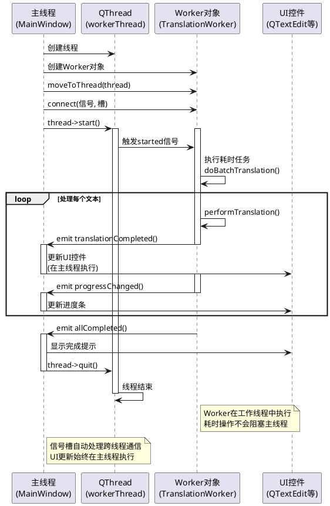

# 2.6 多线程设计说明

## 一、为什么需要多线程？（避免 UI 阻塞）

在 GUI 应用程序中，**主线程（UI 线程）负责处理所有用户界面的绘制和交互事件**。如果在主线程中执行耗时操作（如大量数据处理、文件 I/O、网络请求、复杂计算等），会导致界面冻结、无响应，严重影响用户体验。

**本系统的实际情况：**
- 当前实现使用 `QNetworkAccessManager` 的异步机制处理网络请求，避免了 UI 阻塞
- 如果未来需要处理大量数据的批量导入导出、复杂的翻译结果后处理、本地文件搜索等耗时操作，则需要使用多线程技术

**多线程的优势：**
1. **保持 UI 响应性**：将耗时任务放在工作线程执行，主线程继续处理用户交互
2. **充分利用多核 CPU**：多线程可以并行处理任务，提高程序性能
3. **提升用户体验**：在后台执行任务时，用户可以继续操作界面，系统可以通过进度条、状态栏等方式反馈任务进度

---

## 二、使用 QThread / QtConcurrent 的理由

### 1. **QThread 的特点和适用场景**

`QThread` 是 Qt 提供的线程类，提供了更精细的线程控制能力：

**优势：**
- ✅ **精确控制线程生命周期**：可以控制线程的创建、启动、停止、销毁
- ✅ **适合长时间运行的任务**：如文件监控、数据采集、后台服务等
- ✅ **可以实现任务取消**：通过标志位控制任务中断
- ✅ **自定义 Worker 类**：可以将业务逻辑封装在独立的 Worker 类中，代码结构清晰

**适用场景：**
- 需要长时间运行的后台任务
- 需要精确控制线程状态的任务
- 需要在任务执行过程中进行交互（暂停、取消等）的任务

**代码示例（设计示例）：**
```cpp
// Worker 类（在 worker.h 中定义）
class TranslationWorker : public QObject
{
    Q_OBJECT
public:
    explicit TranslationWorker(QObject *parent = nullptr);
    
public slots:
    void doWork(const QString &text);  // 执行耗时任务
    
signals:
    void resultReady(const QString &result);  // 任务完成信号
    void progressUpdated(int percentage);     // 进度更新信号
    void errorOccurred(const QString &error); // 错误信号
};

// 使用方式
QThread *thread = new QThread;
TranslationWorker *worker = new TranslationWorker;
worker->moveToThread(thread);
connect(thread, &QThread::started, worker, &TranslationWorker::doWork);
connect(worker, &TranslationWorker::resultReady, this, &MainWindow::handleResult);
thread->start();
```

### 2. **QtConcurrent 的特点和适用场景**

`QtConcurrent` 是 Qt 提供的高级并发 API，基于函数式编程模型：

**优势：**
- ✅ **使用简单**：无需管理线程，Qt 自动管理线程池
- ✅ **适合一次性任务**：如数据过滤、映射、归约等操作
- ✅ **函数式编程**：代码简洁，易于理解
- ✅ **自动负载均衡**：Qt 根据 CPU 核心数自动分配任务

**适用场景：**
- 需要对容器中的数据进行批量处理（如 QList、QVector）
- 数据过滤、映射、归约等函数式操作
- 一次性计算任务，不需要持续运行

**代码示例（设计示例）：**
```cpp
// 使用 QtConcurrent::run 执行简单任务
QFuture<QString> future = QtConcurrent::run([=]() {
    // 在后台线程执行的耗时操作
    QString result = performHeavyComputation(inputText);
    return result;
});

// 使用 QFutureWatcher 监控任务状态
QFutureWatcher<QString> *watcher = new QFutureWatcher<QString>(this);
connect(watcher, &QFutureWatcher<QString>::finished, [=]() {
    QString result = watcher->result();
    ui->textEditResult->setPlainText(result);
});
watcher->setFuture(future);
```

### 3. **本系统的选择建议**

对于翻译工具系统，推荐使用 **QThread + Worker 类**的方式：

**理由：**
1. **任务特征**：翻译请求可能需要处理多个文本，需要显示进度和允许取消
2. **扩展性**：未来可能需要添加批量翻译、文件翻译等功能，QThread 更适合
3. **控制能力**：需要精确控制任务执行状态，如暂停、取消、重试等
4. **代码组织**：Worker 类可以将业务逻辑与 UI 完全分离，便于测试和维护

---

## 三、Thread Worker 类设计说明

### Worker 类设计模式

**设计原则：**
1. **继承 QObject**：Worker 类必须继承自 `QObject`，才能使用信号槽机制
2. **使用槽函数执行任务**：将耗时操作放在槽函数中，通过信号触发执行
3. **通过信号返回结果**：任务完成后通过信号将结果传递给主线程
4. **使用 moveToThread()**：将 Worker 对象移动到工作线程中执行

### Worker 类设计示例（TranslationWorker）

**头文件（translationworker.h）：**
```cpp
#ifndef TRANSLATIONWORKER_H
#define TRANSLATIONWORKER_H

#include <QObject>
#include <QString>

class TranslationWorker : public QObject
{
    Q_OBJECT

public:
    explicit TranslationWorker(QObject *parent = nullptr);
    
    // 设置是否停止任务的标志
    void setStopFlag(bool stop) { m_stop = stop; }

public slots:
    // 执行批量翻译任务（耗时操作）
    void doBatchTranslation(const QStringList &textList);
    
    // 执行单个文本的复杂处理（如文本清洗、格式化等）
    void processText(const QString &text);

signals:
    // 单个翻译结果完成
    void translationCompleted(int index, const QString &source, const QString &result);
    
    // 全部任务完成
    void allCompleted();
    
    // 进度更新（0-100）
    void progressChanged(int percentage);
    
    // 错误信号
    void error(const QString &message);

private:
    bool m_stop;  // 停止标志，用于任务取消
    QString performTranslation(const QString &text);  // 执行翻译的私有方法
};

#endif // TRANSLATIONWORKER_H
```

**实现文件（translationworker.cpp）：**
```cpp
#include "translationworker.h"
#include <QThread>
#include <QDebug>

TranslationWorker::TranslationWorker(QObject *parent)
    : QObject(parent), m_stop(false)
{
}

void TranslationWorker::doBatchTranslation(const QStringList &textList)
{
    m_stop = false;
    int total = textList.size();
    
    for (int i = 0; i < total; ++i) {
        if (m_stop) {
            emit error(tr("任务已取消"));
            return;
        }
        
        // 执行翻译（耗时操作）
        QString result = performTranslation(textList[i]);
        
        // 发送单个结果
        emit translationCompleted(i, textList[i], result);
        
        // 更新进度
        int progress = (i + 1) * 100 / total;
        emit progressChanged(progress);
        
        // 模拟耗时，实际中这里是网络请求或复杂计算
        QThread::msleep(100);
    }
    
    emit allCompleted();
}

void TranslationWorker::processText(const QString &text)
{
    if (m_stop) {
        return;
    }
    
    // 执行文本处理（耗时操作）
    QString processed = text.toUpper().trimmed();  // 示例处理
    
    emit translationCompleted(0, text, processed);
}

QString TranslationWorker::performTranslation(const QString &text)
{
    // 这里执行实际的翻译逻辑
    // 可以是网络请求、本地处理等
    return QString("翻译结果: %1").arg(text);
}
```

### 主线程中使用 Worker

**在 MainWindow 中使用 Worker：**
```cpp
// 在 MainWindow 头文件中
class MainWindow : public QMainWindow
{
    // ...
private:
    QThread *m_workerThread;
    TranslationWorker *m_worker;
};

// 在 MainWindow 构造函数中
MainWindow::MainWindow(QWidget *parent) : QMainWindow(parent)
{
    // 创建线程和 Worker
    m_workerThread = new QThread(this);
    m_worker = new TranslationWorker;
    
    // 将 Worker 移动到工作线程
    m_worker->moveToThread(m_workerThread);
    
    // 连接信号槽
    connect(m_workerThread, &QThread::started, m_worker, 
            &TranslationWorker::doBatchTranslation);
    connect(m_worker, &TranslationWorker::translationCompleted,
            this, &MainWindow::onTranslationCompleted);
    connect(m_worker, &TranslationWorker::progressChanged,
            this, &MainWindow::onProgressChanged);
    connect(m_worker, &TranslationWorker::allCompleted,
            this, &MainWindow::onAllCompleted);
    connect(m_worker, &TranslationWorker::error,
            this, &MainWindow::onWorkerError);
    
    // 线程结束时自动清理 Worker
    connect(m_workerThread, &QThread::finished, m_worker, &QObject::deleteLater);
    connect(m_workerThread, &QThread::finished, m_workerThread, &QObject::deleteLater);
}

// 启动任务
void MainWindow::startBatchTranslation(const QStringList &textList)
{
    if (m_workerThread->isRunning()) {
        return;  // 线程已在运行
    }
    
    // 启动线程，会触发 Worker 的 doBatchTranslation 槽函数
    m_workerThread->start();
    // 注意：需要在线程启动后调用 doBatchTranslation
    QMetaObject::invokeMethod(m_worker, "doBatchTranslation", 
                              Q_ARG(QStringList, textList));
}

// 处理结果（在主线程中执行）
void MainWindow::onTranslationCompleted(int index, const QString &source, const QString &result)
{
    // 更新 UI（这是安全的，因为槽函数在主线程执行）
    ui->textEditResult->append(QString("%1: %2").arg(source, result));
}

// 停止任务
void MainWindow::stopTranslation()
{
    m_worker->setStopFlag(true);
    m_workerThread->quit();
    m_workerThread->wait();  // 等待线程结束
}
```

---

## 四、线程与 UI 通信流程图（信号槽机制）

### 流程图（PlantUML 代码）：



### 通信机制说明：

1. **信号发送**：Worker 在工作线程中执行任务时，通过 `emit` 发送信号（如 `translationCompleted`、`progressChanged`）
2. **信号传递**：Qt 的信号槽机制自动将信号从工作线程传递到主线程
3. **槽函数执行**：连接的槽函数在主线程中执行，确保 UI 操作的安全性
4. **数据传递**：信号可以携带参数（如翻译结果、进度值），通过信号参数传递给主线程
5. **线程安全**：Qt 的信号槽机制是线程安全的，无需手动加锁

---

## 五、线程与主线程的关系

### 1. **线程关系概述**

在 Qt 应用程序中，存在以下线程关系：

- **主线程（UI 线程）**：
  - 应用程序启动时自动创建
  - 负责所有 UI 绘制和事件处理
  - 必须所有 UI 操作都在主线程执行
  - 包含 Qt 的事件循环（`QApplication::exec()`）

- **工作线程（Worker Thread）**：
  - 通过 `QThread` 手动创建
  - 执行耗时任务，不直接操作 UI
  - 可以创建多个工作线程并行处理任务
  - 拥有独立的事件循环（如果调用 `exec()`）

### 2. **线程生命周期关系**

```
应用程序启动
    ↓
创建主线程（自动）
    ↓
MainWindow 构造函数
    ↓
创建 QThread 对象（在主线程中创建对象，但线程未启动）
    ↓
创建 Worker 对象（在主线程中创建对象）
    ↓
worker->moveToThread(thread)  // 将 Worker 对象移动到工作线程
    ↓
thread->start()  // 启动工作线程
    ↓
┌─────────────────┬─────────────────┐
│   主线程        │   工作线程       │
│                │                 │
│ - UI 绘制      │ - 执行耗时任务  │
│ - 事件处理     │ - Worker 槽函数 │
│ - 槽函数响应   │ - 发送信号      │
│                │                 │
└─────────────────┴─────────────────┘
    ↓                ↓
接收 Worker 信号   任务完成
    ↓                ↓
更新 UI            thread->quit()
    ↓                ↓
              线程结束
    ↓                ↓
          Worker 自动清理
```

### 3. **对象所有权和内存管理**

- **QThread 对象**：在主线程中创建，主线程拥有所有权
- **Worker 对象**：在主线程中创建，但通过 `moveToThread()` 移动到工作线程的事件循环中
- **信号槽连接**：连接在主线程中建立，但信号在工作线程发送，槽在主线程执行
- **对象清理**：通过信号槽连接，在线程结束时自动清理 Worker 对象

### 4. **数据传递规则**

**从主线程到工作线程：**
- 通过信号参数传递（线程安全）
- 通过 `QMetaObject::invokeMethod()` 调用 Worker 槽函数
- 不能直接传递 Qt 窗口对象的指针（不安全）

**从工作线程到主线程：**
- 通过信号传递（Qt 自动处理跨线程）
- 信号参数会被复制，确保数据安全
- 槽函数在主线程执行，可以安全地操作 UI

### 5. **注意事项**

1. **不要在 Worker 中直接操作 UI**：UI 对象只能在主线程中访问，在工作线程中操作 UI 会导致程序崩溃或未定义行为

2. **使用信号槽进行通信**：Qt 的信号槽机制会自动处理跨线程调用，是最安全的线程间通信方式

3. **避免共享数据竞争**：如果 Worker 和主线程需要共享数据，应该使用线程安全的数据结构（如 `QMutex`、`QReadWriteLock`、`QAtomicInt` 等）

4. **正确管理线程生命周期**：确保在线程结束前停止所有任务，使用 `quit()` 和 `wait()` 确保线程完全结束

5. **moveToThread() 的使用**：Worker 对象必须通过 `moveToThread()` 移动到工作线程，否则槽函数仍在主线程执行

---

## 六、总结

多线程设计是确保 GUI 应用程序响应性的关键技术：

1. **避免 UI 阻塞**：通过将耗时任务放到工作线程，保持主线程响应流畅
2. **QThread vs QtConcurrent**：QThread 提供精确控制，适合长时间任务；QtConcurrent 使用简单，适合一次性计算任务
3. **Worker 类设计**：通过继承 QObject、使用槽函数执行任务、通过信号返回结果，实现业务逻辑与 UI 的分离
4. **信号槽通信**：Qt 的信号槽机制自动处理跨线程通信，确保 UI 更新在主线程执行
5. **线程关系**：主线程负责 UI，工作线程执行耗时任务，通过信号槽实现安全的线程间通信


