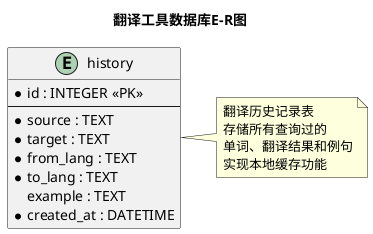

# 数据库结构设计

## 2.3.1 数据库E-R图（PlantUML代码）

**说明：** 当前系统实现中只包含一张 `history` 表，用于存储翻译历史记录。E-R图展示单实体结构。

---

## 2.3.2 表结构定义

### 表1：history（翻译历史记录表）

| 表名 | 字段 | 数据类型 | 说明 |
|------|------|---------|------|
| **history** | id | INTEGER PRIMARY KEY AUTOINCREMENT | 主键，自增ID，唯一标识每条历史记录 |
| | source | TEXT | 原文（待翻译的单词或句子），存储用户输入的查询内容 |
| | target | TEXT | 译文（翻译结果，包含多个释义的格式化文本），存储解析后的翻译内容 |
| | from_lang | TEXT | 源语言代码（如"en"表示英语，"zh-CN"表示中文），标识原文语言 |
| | to_lang | TEXT | 目标语言代码（如"zh-CN"表示中文，"en"表示英语），标识目标语言 |
| | example | TEXT | 例句信息（原句和翻译例句的组合文本，格式为"原句：...\\n翻译：..."），可为空 |
| | created_at | DATETIME DEFAULT CURRENT_TIMESTAMP | 记录创建时间，默认值为当前时间戳，用于按时间排序和筛选查询 |

**表设计说明：** 
- 该表是系统的核心数据表，用于存储所有翻译查询的历史记录，实现本地缓存功能。
- 当用户查询相同的单词和语言方向组合时，系统会优先从该表中读取缓存结果，避免重复的网络请求，提高响应速度。
- 表设计采用主键自增ID，支持高效的查询、插入和删除操作。通过 `source`、`from_lang` 和 `to_lang` 三个字段的组合查询实现缓存匹配逻辑。
- 该表同时作为历史记录展示的数据源，通过 QSqlTableModel 绑定到 QTableView 视图，实现 Model/View 架构的数据展示。

**索引建议：** 为提高查询效率，可在 `(source, from_lang, to_lang)` 上建立组合索引，但SQLite在小数据量情况下性能已足够。

